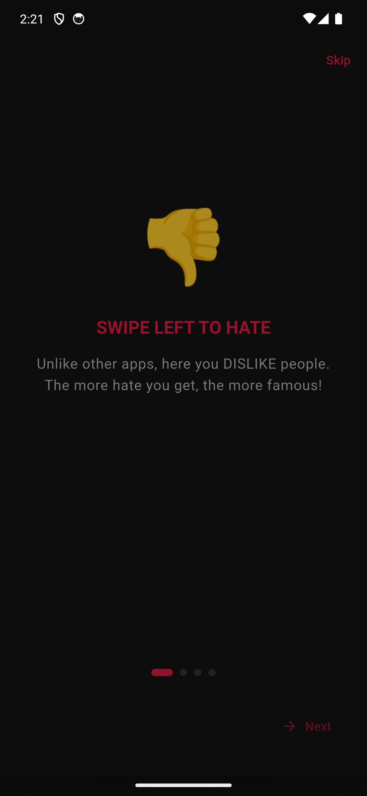
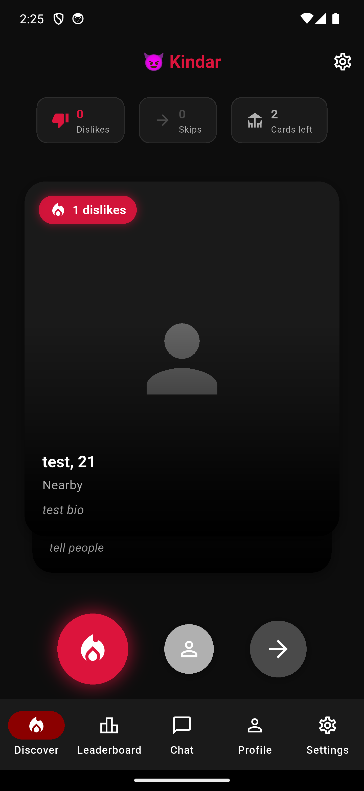
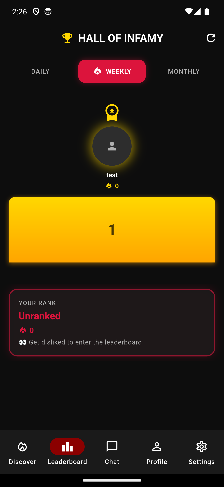
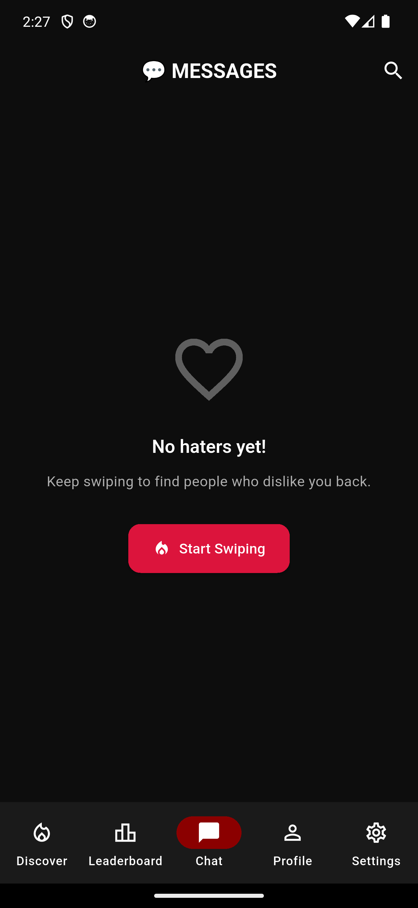
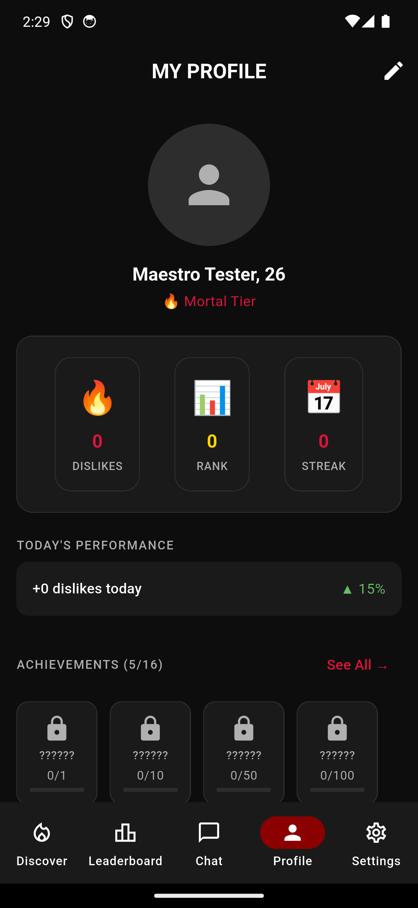
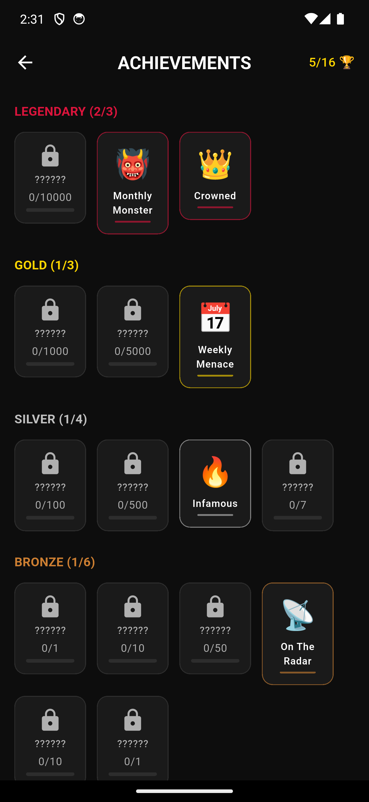

# Kındar

> **The anti-Tinder.** Get matched with people who *dislike* you the most. Collect dislikes. Become famous.

---

## 💡 The concept

Every dating app on Earth is built around the same emotional currency: getting people to *like* you. Match counts, hearts, super-likes, premium boosts — they all assume affection is what we want to maximize.

**Kındar throws that out the window.** Here's the deal:

- 🔄 **You swipe right to dislike** and left to like.
- 💔 **Dislikes are the score.** The more strangers can't stand the look of you, the higher you climb.
- 🏆 **The leaderboard ranks the most-disliked people in the country.** Daily, weekly, all-time.
- 🎖️ **Achievements** reward milestones like *"100 dislikes in a single day"* and *"Hated in 5 cities"*.
- 💬 **A match still gets you a chat** — but now it's a chat with your nemesis. Whether you actually talk is your problem.

It's social media's id wearing a tuxedo: the part of the internet that already exists, except this time the metric is honest.

The name is a play on the Turkish **kın** ("scorn / disapproval") + Tinder — *"the Tinder of contempt."*

## 🛠️ Tech stack

**Framework**

**State management & navigation**

**Backend & auth**

**UI / UX**

**Networking & storage**

**Utilities**

## ✨ Features (implemented or in active development)

The repo intentionally ships only the project manifest (`pubspec.yaml`) and this README — the source tree stays private while the app is in development. Below is what is being built, derived from the project structure rather than guesswork.

### 🔑 Onboarding & authentication
- Splash screen
- Multi-step onboarding flow
- Email/password login
- Phone-number authentication (Firebase Auth)
- Google Sign-In
- Sign in with Apple
- Initial profile setup wizard

### 💔 The core swipe loop
- Card-stack swipe UI (`flutter_card_swiper`)
- Custom action buttons (dislike / like / super-dislike) with haptic feedback
- Card overlays that surface user info as you swipe
- Animated card transitions

### 🏆 Leaderboard
- Top-three podium for the most-disliked profiles
- Period tabs (daily / weekly / all-time)
- Personal rank card showing where you sit
- Per-user leaderboard entries with regional / interest cuts

### 🏅 Achievements & stats
- Achievement badges unlocked by dislike milestones
- Per-user stat dashboard (total dislikes, streaks, regional reach)
- Photo gallery + interest-tag profile cards

### 💬 Chat (post-match)
- Match-notification overlay when two profiles mutually dislike each other
- Real-time chat backed by Firestore
- Typing indicator, message bubbles, date separators
- Empty-state UI for chats with no messages yet

### ⚙️ Settings
- Age-range filter
- Distance filter
- Theme switching (light / dark / system)
- Toggle / slider / navigation primitives shared across settings screens

### 🔧 Infrastructure
- Riverpod providers organized by domain (auth, swipe, chat, leaderboard, settings, user, app state)
- Firebase services layer (auth, chat, leaderboard, swipe, user) abstracted behind interfaces
- Storage service abstraction with a placeholder implementation (Cloudinary integration planned)
- Centralized routing via `go_router`
- Theme + constants + Firestore-collection name configuration

## 📸 Screenshots

|  |  |  |
|:---:|:---:|:---:|
| **Onboarding** | **Swipe deck** | **Leaderboard** |
|  |  |  |
| **Chat** | **Profile** | **Achievements** |

## 🚧 Project status

This project is **under active development** and not yet ready for general use:

- The source tree is **not part of this public repo** — only the manifest and design are public. Code lives privately while the app is being shaped.
- APIs, schemas, and the overall product flow are still changing.
- Firebase project configuration (`firebase_options.dart`) ships separately and is not checked in.
- No releases have been published yet.

If you want to follow along, watch the repo — milestones will be tagged once the app reaches MVP.

## 🗺️ Roadmap (high-level)

1. **Phase 1 — MVP** ✅ in progress
   Swipe loop, basic auth, dummy data feed, local leaderboard.
2. **Phase 2 — Live backend**
   Wire Firestore for swipes/matches; replace dummy data with real users.
3. **Phase 3 — Media**
   Cloudinary integration for profile photos; image cropping pipeline.
4. **Phase 4 — Polish**
   Push notifications, deep links, accessibility passes, app-store assets.

## 👤 Author

**Muhammet Subaşı** — Computer Engineer, MS student at Hacettepe University.
🌐 [github.com/Msubasi1](https://github.com/Msubasi1) · [LinkedIn](https://www.linkedin.com/in/muhammetsubasi/)

---

> _Why "Kındar"?_ Because *Tinder* is built on the fiction that everyone is lovable. Kındar is built on something more honest.
